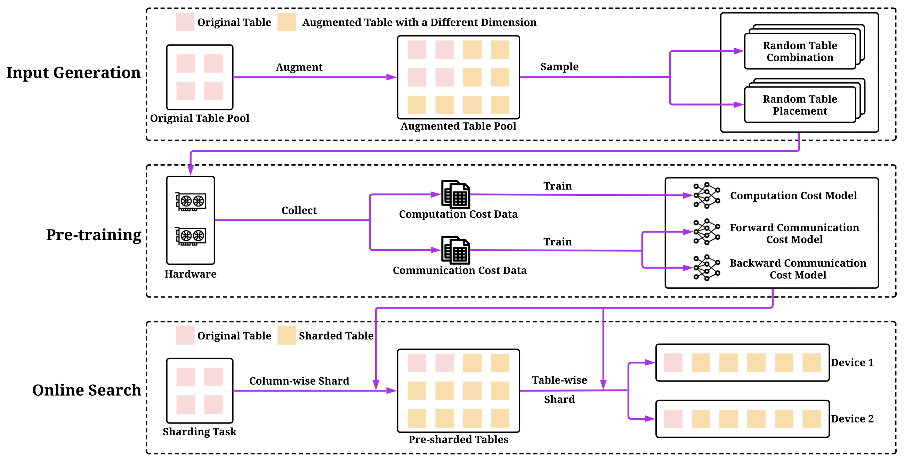

# NeuroShard

This is the code for the **Pre-trained Neural Cost Models for Efficient Embedding Table Sharding in Deep Learning Recommendation Models**. We only provide the instructions to reproduce the results on the DLRM datasets but not the production dataset due to data privacy. Note that this repo is still under the review of artifact submission The code is not final and is subject to changes.



Neuroshard utilizes pre-trained cost models for embedding table sharding, and generally involves the following steps:
*   **Input generation:** A large number of possible table configurations with data augmentation are randomly generated, along with a large number of possible table sharding plans with varying levels of balance.
*   **Pre-training:** The cost of each generated data point on hardware is evaluated, and three neural networks are pre-trained to predict computation cost, forward communication cost, and backward communication cost, respectively.
*   **Online search:** After training the neural cost models, the optimal sharding plan is identified for any sharding task using a search algorithm. The algorithm does not rely on hardware to obtain costs during the search process, instead using the cost models, which is efficient.

## Installation

**Step 1: install PyTorch**
```
pip3 install torch==1.8.0
```

**Step 2: install FBGEMM**

Follow the instructions in [https://github.com/pytorch/FBGEMM](https://github.com/pytorch/FBGEMM) to install the embedding operators

**Step 3: install NeuroShard**
```
pip3 install -e .
```

## Run on the DLRM Dataset

**Step 1: Download DLRM dataset**

Download the data with `git lfs` at [https://github.com/facebookresearch/dlrm_datasets](https://github.com/facebookresearch/dlrm_datasets)

**Step 2: Process the dataset**
```
python3 tools/gen_dlrm_data.py
```
Note that you need to change `--data` argument to the path of the downloaded DLRM dataset.

**Step 3: Generate training and testing tasks**
```
python3 tools/gen_tasks.py
```
Note that `--data_dir` specifies the DLRM dataset directory, and `--out_dir` indicates the output directory.

**Step 4: Collect cost data**
```
python3 collect_compute_cost_data.py
```
The important arguments are as follows.

*   `--gpu_devices`: which GPUs to use for benchmarking.
*   `--max_tables`: the maximum number of tables in a GPU device.
*   `--max_mem`: the maximum memory of a GPU device.
*   `--max_dim`: the maximum table dimension of each table.
*   `--dataset_dir`: the directory of DLRM dataset.
*   `--out_dir`: the output directory of the collected data.

```
python3 collect_comm_cost_data.py
```
The important arguments are as follows.

*   `--gpu_devices`: which GPUs to use for benchmarking.
*   `--T_range`: the range of the numbers of tables in a sharding task.
*   `--sleep_range`: the range of times each GPU sleeps in milliseconds.
*   `--max_dim`: the maximum table dimension of each table.
*   `--out_dir`: the output directory of the collected data.

**Step 5: Train neural cost models**
```
python3 train_compute_cost_model.py
```
The important arguments are as follows.

*   `--data_dir`: the directory of compute cost data.
*   `--epochs`: the number training epochs.
*   `--out_path`: the path of the outputted model.

```
python3 train_comm_cost_model.py
```
The important arguments are as follows.

*   `--data_dir`: the directory of compute cost data.
*   `--epochs`: the number training epochs.
*   `--fw_out_path`: the path of the outputted forward comm model.
*   `--bw_out_path`: the path of the outputted backward comm model.

**Step 6: Shard in simulator**
Once we have pre-trained cost models, we can shard tables and get estimated costs with the simulator.
```
python3 eval_simulator.py --alg neuroshard
```
The important arguments are as follows.

*   `--alg`: the sharding algorithm
*   `--ndevices`: the number of GPU devices.
*   `--max_mem`: the maximum memory of a GPU device.

To obtain the results of the baselines, change `--alg` to `random`, `dim_greedy`, `lookup_greedy`, `size_greedy`, or `size_lookup_greedy`.

**Step 7: Evaluate on hardware**
We can also obtain real costs from hardware.
```
python3 eval.py --alg neuroshard
```
The important arguments are as follows.

*   `--data_dir`: the directory of compute cost data.
*   `--alg`: the sharding algorithm
*   `--gpu_devices`: which GPUs to use for evaluation.
*   `--max_mem`: the maximum memory of a GPU device.

To obtain the results of the baselines, change `--alg` to `random`, `dim_greedy`, `lookup_greedy`, `size_greedy`, or `size_lookup_greedy`.

**Step 8: Other baselines**

You can run other baselines with the authors' codes as follows:

*   AutoShard: [https://github.com/daochenzha/autoshard](https://github.com/daochenzha/autoshard)
*   DreamShard: [https://github.com/daochenzha/dreamshard](https://github.com/daochenzha/dreamshard)
*   TorchRec: [https://github.com/pytorch/torchrec](https://github.com/pytorch/torchrec)

